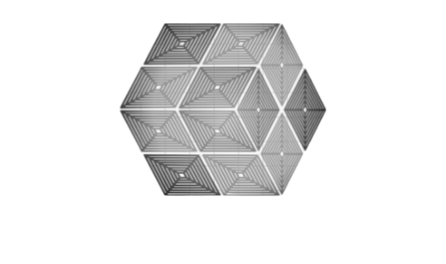

# Home
---

>> The objective of this documentation project is to bring, in a more detailed way, tutorials on installation, configuration and applicability of open source systems and implementations tested in practice.

  

  

Darklab™ | Documentation | Tutorials. <a><i>All rights reserved.</i></a>
